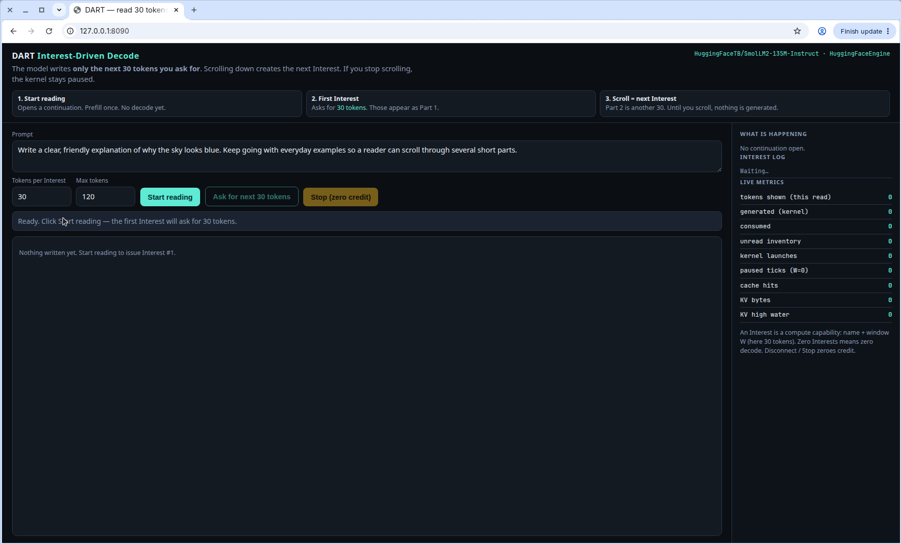
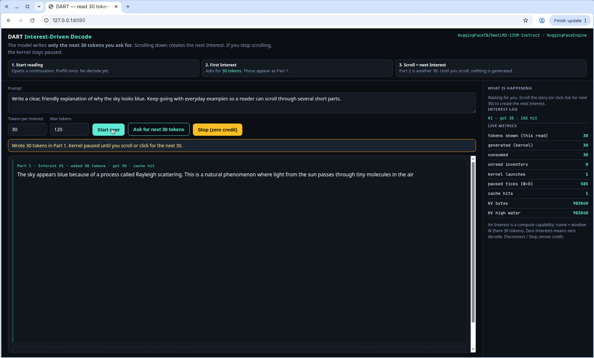

# DART

**Demand-Addressed Runtime Tokens**

[](https://www.python.org/)
[](LICENSE)
[](#http-api)

> Outstanding Interests are the only thing that may run a decode kernel.

DART is a continuation runtime that sits in front of an existing LLM engine. Consumers pull the tokens they can absorb. Producers generate only that window. Any peer that already holds the named object answers without a GPU.

It is a control plane, not a GPU fleet. vLLM and llama.cpp stay the kernels.

```text
/cip/<model-hash>/<kv-root>/tokens/seg/<i>
```

<p align="center">
  
</p>

<p align="center">
  
</p>

<p align="center"><sub>Model: <b>HuggingFaceTB/SmolLM2-135M-Instruct</b> (135M, CPU, <code>--engine hf</code>). Interest #1 writes 30 tokens; the kernel stays paused until you scroll.</sub></p>

[Screen recording — scroll-gated 30-token Interests](docs/assets/scroll_gated_idd_console.mp4)

---

## Install

```bash
git clone https://github.com/adityaraj-09/DART.git
cd DART
pip install -e ".[dev]"
```

Python 3.11+. Optional extras: `[hf]` (SmolLM2 / transformers), `[vllm]`, `[llamacpp]`.

---

## Quick start

```bash
dart serve --engine synthetic --port 8090
```

Open [http://127.0.0.1:8090](http://127.0.0.1:8090). **Start reading** issues Interest #1 for 30 tokens. The kernel then pauses. **Scroll the story** (or click **Ask for next 30 tokens**) to create Interest #2. Until you do, nothing more is generated. Stop zeroes credit.

The synthetic engine is a word list for tests. For a **real** (small) model on CPU:

```bash
pip install -e ".[hf]"
dart serve --engine hf --model HuggingFaceTB/SmolLM2-135M-Instruct --port 8090
```

The console header shows the engine. Scroll-gated Interests work the same on synthetic and Hugging Face. [Screen recording](docs/assets/scroll_gated_idd_console.mp4) walks through three 30-token parts.

```bash
curl -N http://127.0.0.1:8090/v1/chat/completions \
  -H 'content-type: application/json' \
  -H 'x-dart-pace: 30' \
  -d '{"model":"dart-synth-8b","stream":true,"messages":[{"role":"user","content":"Hello"}]}'
```

```python
from dart import DartRuntime, SyntheticEngine, ReadingPacer
from dart.client import DartClient

rt = DartRuntime(SyntheticEngine())
async for seg in DartClient(runtime=rt).stream(
    "Explain named continuations.",
    consumer=ReadingPacer(tokens_per_sec=30),
    max_tokens=128,
):
    print(seg.text, end="", flush=True)
```

---

## Product

Most serving stacks generate as fast as the GPU allows, then try to deliver. A token with no consumer credit is a wasted residual-stream step: energy, KV pages, and batch slots.

DART inverts that. An Interest is a compute capability. Zero Interests means zero decode. Cache hits never touch the kernel.

| | Push / max occupancy | Andes | DART |
|---|---|---|---|
| Generate | Then buffer | Then pause the watermark | Only after credit |
| Stop | Drain the buffer | Pause generation | Do not launch the kernel |
| Identity | HTTP request | HTTP request | Named continuation + `kv_root` |

**What you get**

- **Credit-gated decode** — window `W` is tokens, not bytes. Congestion control is the scheduler.
- **Named continuations** — live generation is an address space. Changing machines is answering the next Interest from a new locator.
- **CAS, then pin, then decode** — named Data is free; pinned KV resumes without re-prefill; otherwise the cheapest producer runs.
- **Scroll-gated console** — first Interest writes 30 tokens; scrolling (or the next-page button) creates the next Interest. The kernel stays paused in between.
- **Drop-in HTTP** — OpenAI-compatible `/v1/chat/completions` with `X-Dart-Pace` / `X-Dart-Window`. Disconnect closes the continuation.
- **Mesh** — pin holders, FileCAS peers, and NIXL/LMCache-shaped handover without live-migrating a request.

---

## How it works

```text
Consumer                         DART                              Engine
   │  open(prompt)                  │  prefill (once)                 │
   │───────────────────────────────►│────────────────────────────────►│
   │  lease + kv_root               │                                 │
   │◄───────────────────────────────│                                 │
   │  Interest(name, window W)      │  CAS hit → Data, no GPU         │
   │───────────────────────────────►│  else credit += W, decode ≤ W   │
   │  Data + new kv_root            │────────────────────────────────►│
   │◄───────────────────────────────│◄────────────────────────────────│
```

1. Prefill once. The runtime publishes a lease and a Merkle `kv_root`, not a process snapshot.
2. The consumer issues Interests for the next objects it can absorb.
3. DART answers from CAS, from a pin holder, or by crediting the engine for at most `W` tokens.
4. Handover is a new locator on the next Interest — not a live-migrated HTTP request.

---

## Engines

| Flag | Role |
|---|---|
| `--engine synthetic` | Deterministic CPU producer with real KV-extent accounting. Default for tests. Word-list output, not a language model. |
| `--engine hf` | In-process Hugging Face model. Demo weights: **HuggingFaceTB/SmolLM2-135M-Instruct** (135M, CPU). |
| `--engine vllm` | HTTP adapter to a live vLLM server (`DART_VLLM_URL`). Each Interest is `max_tokens=W`. Enable `--enable-prefix-caching`. |
| `--engine vllm-inprocess` | Waiting-queue plugin: admit once, park in `waiting` with pinned KV when `W=0`. |
| `--engine llamacpp` | HTTP adapter to llama.cpp (`DART_LLAMACPP_URL`). |
| `--engine cache` | CAS-only peer. Never decodes. |

```bash
export DART_ENGINE=vllm
export DART_MODEL=meta-llama/Llama-3.1-8B-Instruct
export DART_VLLM_URL=http://127.0.0.1:8000/v1
export DART_SECRET=replace-me
dart serve --engine vllm --model "$DART_MODEL"
```

---

## Operations

```bash
dart serve --engine synthetic --port 8090          # CIP + OpenAI facade (word-list producer)
dart serve --engine hf --port 8090                 # SmolLM2-135M-Instruct on CPU
dart mesh --nodes 3 --connector nixl --port 8090   # in-process multi-node router
dart peer --cas-dir /var/dart/cas --port 8091      # FileCAS peer, no GPU
dart experiment --suite paper                      # kill-test, Andes, grammar, CAS
dart experiment --suite mesh
dart experiment --suite waiting
```

### HTTP API

| Surface | Purpose |
|---|---|
| `POST /v1/chat/completions` | OpenAI-compatible facade. `X-Dart-Pace`, `X-Dart-Window`. Disconnect closes the continuation. |
| `POST /v1/continuations` + `.../interest` | CIP over HTTP |
| `GET /v1/mesh`, `POST /v1/handover`, `GET /v1/kv` | Pin, route, adopt |
| `WS /v1/cip` | Framed Interest / Data / Nack |
| `GET /metrics`, `GET /v1/metrics` | Prometheus and JSON |

Environment: `DART_ENGINE`, `DART_MODEL`, `DART_SECRET`, `DART_CAS_DIR`, `DART_KV_CONNECTOR`, `DART_PRODUCER_ID`, `DART_PORT`.

---

## Repository layout

```text
src/dart/
  cli.py  factory.py         Entry points
  core/                      Runtime, leases, congestion control, types
  cip/                       CIP names and Merkle kv_root
  kv/                        Token CAS, pinned KV, NIXL/LMCache connectors
  mesh/                      Interest router
  engine/                    Synthetic, HuggingFace, vLLM HTTP, vLLM in-process, llama.cpp
  api/                       FastAPI gateway and demo UI
  client/                    SDK and pacers
  eval/                      Kill-test and paper suites
docs/                        Architecture, protocol, mesh, adapters
paper/                       arXiv-style preprint (LaTeX → PDF)
tests/                       pytest
```

Public imports stay stable:

```python
from dart import DartRuntime, Interest, ReadingPacer
from dart.client import DartClient
```

---

## Documentation

| Guide | Contents |
|---|---|
| [Architecture](docs/architecture.md) | Control loop, process model, kill criteria |
| [Protocol](docs/protocol.md) | CIP names, Interest / Data / Nack, leases |
| [Congestion control](docs/congestion-control.md) | Window, AIMD, speculative K |
| [Engine adapters](docs/engine-adapters.md) | Synthetic, vLLM, llama.cpp |
| [Mesh](docs/mesh.md) | Pin, handover, routing order |
| [Waiting plugin](docs/vllm-plugin.md) | In-process `waiting` + pinned blocks |
| [Limitations](docs/limitations.md) | HTTP admission, prefix-cache eviction, scope |
| [Paper (PDF)](paper/dart_idd.pdf) | Full-length arXiv-style preprint — Aditya Raj |

```bash
cd paper && make          # latexmk -pdf dart_idd.tex
pytest -q
```

---

## Status

DART is Apache-2.0. The HTTP vLLM path re-enters admission; `--engine vllm-inprocess` keeps the request in `waiting` with pinned blocks. Real NIXL RDMA and LMCache GPU pages are optional; tests use in-process memcpy.

See [limitations](docs/limitations.md) for what this repository claims and what it does not.
