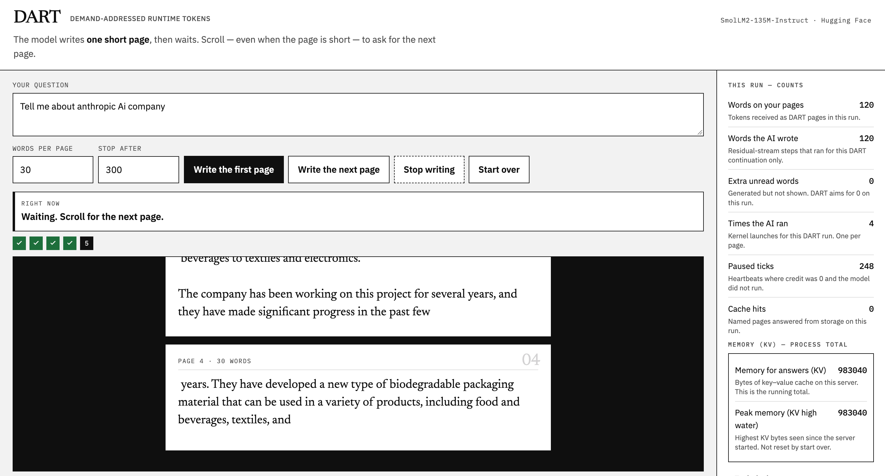

# DART

**Demand-Addressed Runtime Tokens** — Interest-Driven Decode (IDD) for LLM serving.

[](https://www.python.org/)
[](LICENSE)
[](#http-api)

> **Outstanding Interests are the only thing that may run a decode kernel.**

DART is a **continuation runtime** in front of vLLM, llama.cpp, or Hugging Face. Consumers issue **Interests** for the next tokens they can absorb; producers decode only within that credit window. Named segments can be served from cache or another node without touching the GPU.

DART is a **control plane**, not a replacement inference engine. See [limitations](docs/limitations.md) for scope and honest trade-offs.

## Contents

- [Demo](#demo)
- [Install](#install)
- [Quick start](#quick-start)
- [HTTP API](#http-api)
- [Python SDK](#python-sdk)
- [Engines](#engines)
- [CLI](#cli)
- [Configuration](#configuration)
- [Documentation](#documentation)
- [Development](#development)

---

## Demo

<p align="center">
  
</p>

<p align="center">
  <sub>
    <code>--engine hf</code> with <b>HuggingFaceTB/SmolLM2-135M-Instruct</b> (135M, CPU).
    The kernel stays idle until the user scrolls or requests the next page.
  </sub>
</p>

<p align="center">
  <a href="docs/assets/demo.mov">Screen recording</a> — scroll-gated Interests in the demo UI.
</p>

CIP object names look like:

```text
/cip/<model-hash>/<kv-root>/tokens/seg/<i>
```

---

## Install

**Requirements:** Python 3.11+

```bash
git clone https://github.com/adityaraj-09/DART.git
cd DART
python3 -m venv .venv
source .venv/bin/activate   # Windows: .venv\Scripts\activate
pip install -e ".[dev]"
```

Optional extras: `[hf]` (transformers / demo model), `[vllm]`, `[llamacpp]`.

### CLI name clash

If `dart serve` fails with “Could not find a command named serve”, your shell is invoking the **Dart language SDK** (often via Flutter), not this project.

Use the virtualenv (`source .venv/bin/activate`) or run explicitly:

```bash
python -m dart serve --engine synthetic --port 8090
```

---

## Quick start

**1. Synthetic producer (tests and local demo UI)**

```bash
python -m dart serve --engine synthetic --port 8090
```

Open [http://127.0.0.1:8090](http://127.0.0.1:8090). The first page requests ~30 tokens; generation pauses until you scroll or click for the next page.

**2. Small real model on CPU**

```bash
pip install -e ".[hf]"
python -m dart serve --engine hf --model HuggingFaceTB/SmolLM2-135M-Instruct --port 8090
```

**3. Production GPU (in-process vLLM, admit once + pinned KV when idle)**

```bash
pip install -e ".[vllm]"
python -m dart serve --engine vllm --model meta-llama/Llama-3.1-8B-Instruct --port 8090
```

Details per backend: [Engine adapters](docs/engine-adapters.md).

---

## HTTP API

| Endpoint | Purpose |
|----------|---------|
| `POST /v1/chat/completions` | OpenAI-compatible streaming; pace via `X-Dart-Pace`, window via `X-Dart-Window` |
| `POST /v1/continuations` | Open a continuation (prefill) |
| `POST /v1/continuations/{id}/interest` | CIP Interest for the next segment |
| `GET /metrics`, `GET /v1/metrics` | Prometheus / JSON metrics |

Disconnecting the client **zeros decode credit** and stops further kernel work for that continuation.

```bash
curl -N http://127.0.0.1:8090/v1/chat/completions \
  -H 'content-type: application/json' \
  -H 'x-dart-pace: 30' \
  -d '{"model":"dart-synth-8b","stream":true,"messages":[{"role":"user","content":"Hello"}]}'
```

Full CIP and lease fields: [Protocol](docs/protocol.md).

---

## Python SDK

```python
import asyncio
from dart import DartRuntime, SyntheticEngine, ReadingPacer
from dart.client import DartClient

async def main():
    rt = DartRuntime(SyntheticEngine())
    async for seg in DartClient(runtime=rt).stream(
        "Explain named continuations.",
        consumer=ReadingPacer(tokens_per_sec=30),
        max_tokens=128,
    ):
        print(seg.text, end="", flush=True)

asyncio.run(main())
```

Pacers (reading, TTS, viewport, JSON, tool-call) turn consumer speed into Interests — see [Architecture §8](docs/architecture.md#8-public-surfaces).

---

## Engines

| `--engine` | Use when |
|------------|----------|
| `synthetic` | Default. Deterministic CPU producer for tests and the demo UI. |
| `hf` | In-process Hugging Face model (SmolLM2 demo on CPU). |
| `vllm` / `vllm-inprocess` | **Recommended for GPU:** one admission, `waiting` + pinned KV at `W=0`. |
| `vllm-http` | Remote OpenAI API to vLLM; each Interest re-enters admission (see [limitations](docs/limitations.md)). |
| `llamacpp` | HTTP adapter to llama.cpp (`DART_LLAMACPP_URL`). |
| `cache` | CAS-only peer; never decodes. |

Setting `DART_VLLM_URL` while using `--engine vllm` selects the HTTP adapter instead of in-process pin.

---

## CLI

```bash
python -m dart serve   --engine synthetic --port 8090
python -m dart serve   --engine hf --port 8090
python -m dart mesh    --nodes 3 --connector memory --port 8090
python -m dart peer    --cas-dir /var/dart/cas --port 8091
python -m dart experiment --suite paper    # kill-test, Andes, grammar, CAS peer
python -m dart experiment --suite idle     # W=0 must not advance engine forwards
python -m dart experiment --suite waiting  # in-process vLLM pin path
python -m dart experiment --suite mesh
```

---

## Configuration

| Variable | Meaning |
|----------|---------|
| `DART_ENGINE`, `DART_MODEL` | Default engine and model id |
| `DART_SECRET`, `DART_SECRET_PREV` | HMAC lease signing and rotation |
| `DART_PORT` | Listen port (default `8090`) |
| `DART_CAS_DIR` | Persistent token CAS |
| `DART_PIN_DIR` | Persistent pin table |
| `DART_KV_CONNECTOR` | `memory` \| `file` \| `lmcache` \| `nixl` |
| `DART_VLLM_URL` | If set with `vllm`, use HTTP adapter |
| `DART_LLAMACPP_URL` | llama.cpp server base URL |
| `DART_TENANT_QUOTA` | Per-tenant Interest quota |

---

## Documentation

| Guide | Topics |
|-------|--------|
| [Architecture](docs/architecture.md) | Control loop, layers, security, kill criteria |
| [Protocol](docs/protocol.md) | CIP names, Interest / Data / Nack, leases |
| [Congestion control](docs/congestion-control.md) | Window, AIMD, speculative *K* |
| [Engine adapters](docs/engine-adapters.md) | Synthetic, HF, vLLM, llama.cpp |
| [vLLM waiting plugin](docs/vllm-plugin.md) | In-process `waiting` + pinned blocks |
| [Mesh](docs/mesh.md) | Pin, handover, routing |
| [Limitations](docs/limitations.md) | HTTP admission, prefix cache, scope |
| [Paper (PDF)](paper/dart_idd.pdf) | arXiv-style preprint |

---

## Development

```bash
pytest -q
cd paper && make    # build dart_idd.pdf when LaTeX is installed
```

Layout: `src/dart/` (runtime, CIP, engines, API, client, eval), `docs/`, `tests/`, `paper/`.

---

## License

Apache-2.0. Author: Aditya Raj.
